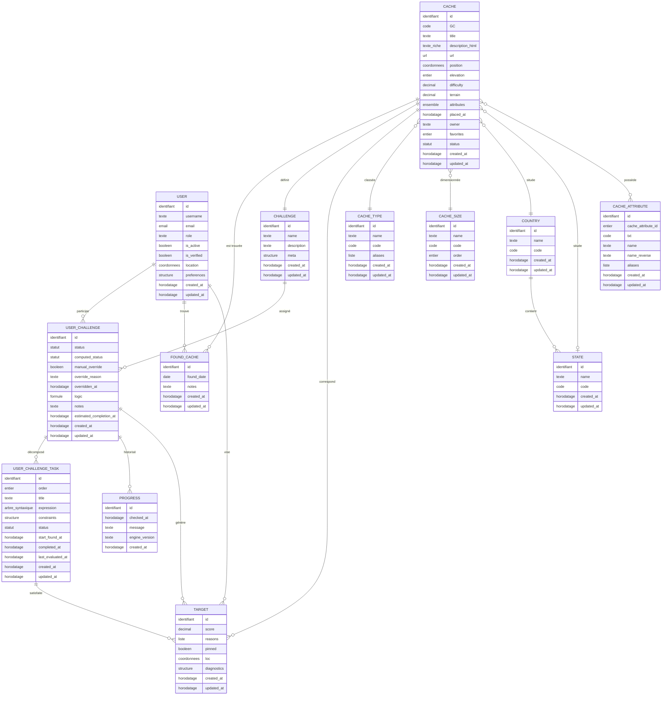
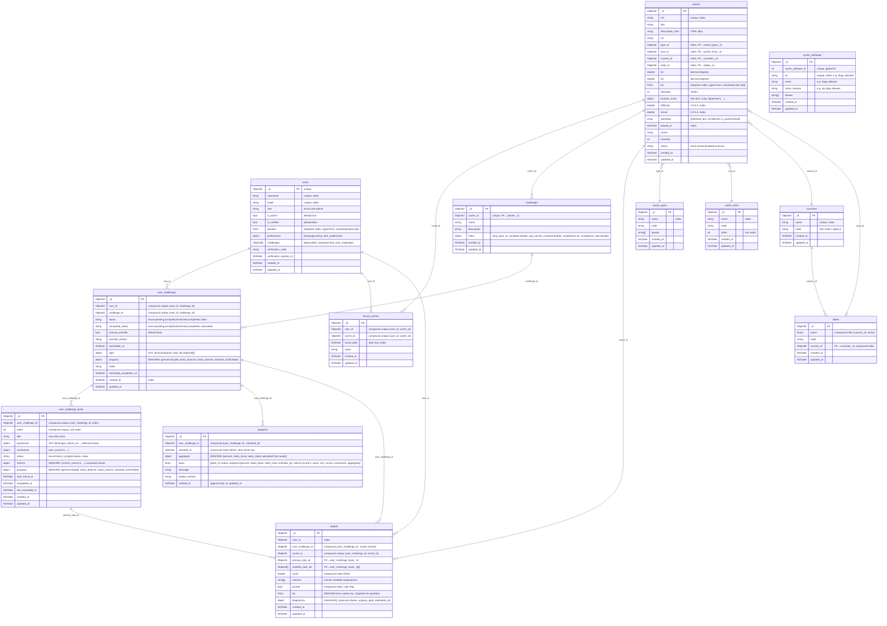

# 5. Composants d'accès aux données

## 5.1 Modèle conceptuel de données


<!-- pagebreak -->
## 5.2 Modèle physique de données


<!-- pagebreak -->
## 5.3 Modèle Cache
```python
# backend/app/models/cache.py
# Modèle principal d'une géocache (métadonnées, typage, localisation, attributs, stats).

from __future__ import annotations
import datetime as dt
from typing import Any, Literal
from pydantic import BaseModel, ConfigDict, Field
from app.core.bson_utils import MongoBaseModel, PyObjectId
from app.core.utils import now

class CacheAttributeRef(BaseModel):
    """Référence d'attribut de cache.

    Description:
        Lien vers un document `cache_attributes` avec indication du sens (positif/négatif).

    Attributes:
        attribute_doc_id (PyObjectId): Référence à `cache_attributes._id`.
        is_positive (bool): True si l'attribut est affirmatif, False s'il est négatif.
    """

    attribute_doc_id: PyObjectId  # référence à cache_attributes._id
    is_positive: bool  # attribut positif (True) ou négatif (False)

    # Sous-modèle: ajouter model_config pour gérer PyObjectId partout (nested)
    model_config = ConfigDict(arbitrary_types_allowed=True, json_encoders={PyObjectId: str})

class CacheBase(BaseModel):
    """Champs de base d'une géocache.

    Description:
        Structure commune pour la création/lecture des caches : identifiants GC, typage,
        localisation (lat/lon + GeoJSON), attributs, difficultés/terrain, dates et stats.
    """

    GC: str
    title: str
    description_html: str | None = None
    url: str | None = None
    # Typage / classement
    type_id: PyObjectId | None = None  # ref -> CacheType
    size_id: PyObjectId | None = None  # ref -> CacheSize
    # Localisation
    country_id: PyObjectId | None = None  # ref -> Country
    state_id: PyObjectId | None = None  # ref -> State
    lat: float | None = None
    lon: float | None = None
    # GeoJSON pour index 2dsphere (coordonnées [lon, lat])
    loc: dict[str, Any] | None = None
    elevation: int | None = None  # en mètres (optionnel)
    location_more: dict[str, Any] | None = None  # infos libres (ville, département...)
    # Caractéristiques
    difficulty: float | None = None  # 1.0 .. 5.0
    terrain: float | None = None  # 1.0 .. 5.0
    attributes: list[CacheAttributeRef] = Field(default_factory=list)
    # Dates & stats
    placed_at: dt.datetime | None = None
    owner: str | None = None
    favorites: int | None = None
    status: Literal["active", "disabled", "archived"] | None = None

# class CacheCreate / CacheUpdate

class Cache(MongoBaseModel, CacheBase):
    """Document Mongo d'une géocache (avec horodatage).

    Description:
        Étend `CacheBase` avec les champs de traçabilité (_id, created_at, updated_at).
    """

    created_at: dt.datetime = Field(default_factory=lambda: now())
    updated_at: dt.datetime | None = None
```

## 5.2 Modèle User Challenge
```python
# backend/app/models/user_challenge.py
# État d'un challenge pour un utilisateur (statuts déclarés/calculés, logique UC, notes, progress).

from __future__ import annotations
import datetime as dt
from typing import Literal
from pydantic import Field
from app.core.bson_utils import MongoBaseModel, PyObjectId
from app.core.utils import now
from app.models._shared import ProgressSnapshot
from app.models.challenge_ast import UCLogic

class UserChallenge(MongoBaseModel):
    """Document Mongo « UserChallenge ».

    Description:
        Lie un utilisateur à un challenge, stocke le statut utilisateur (déclaratif) et le
        statut calculé (évaluation UC logic), ainsi que l'override manuel et un snapshot courant.

    Attributes:
        user_id (PyObjectId): Réf. utilisateur.
        challenge_id (PyObjectId): Réf. challenge.
        status (Literal['pending','accepted','dismissed','completed']): Statut déclaré.
        computed_status (Literal[...] | None): Statut calculé.
        manual_override (bool): Override manuel actif.
        override_reason (str | None): Justification d'override.
        overridden_at (datetime | None): Date override.
        logic (UCLogic | None): Logique d'agrégation des tasks.
        progress (ProgressSnapshot | None): Snapshot global courant.
        notes (str | None): Notes libres.
        created_at (datetime): Création (local).
        updated_at (datetime | None): MAJ.
    """

    user_id: PyObjectId
    challenge_id: PyObjectId
    # Déclaration UTILISATEUR (peut être "completed" même si non satisfaisant algorithmiquement)
    status: Literal["pending", "accepted", "dismissed", "completed"] = "pending"
    # Statut CALCULÉ par l'évaluation (UCLogic sur les tasks)
    computed_status: Literal["pending", "accepted", "dismissed", "completed"] | None = None
    # Traçabilité de l'override
    manual_override: bool = False
    override_reason: str | None = None
    overridden_at: dt.datetime | None = None
    logic: UCLogic | None = None
    # Aggregated, current snapshot for the whole challenge (redundant with history in Progress collection)
    progress: ProgressSnapshot | None = None
    notes: str | None = None
    # Projection
    estimated_completion_at: dt.datetime | None = None
    created_at: dt.datetime = Field(default_factory=lambda: now())
    updated_at: dt.datetime | None = None
```

## 5.3 Modèle User Challenge Task
```python
# backend/app/models/user_challenge_task.py
# Tâche déclarée dans un UserChallenge : expression AST, contraintes, statut et métriques.

from __future__ import annotations
import datetime as dt
from pydantic import Field
from app.core.bson_utils import MongoBaseModel, PyObjectId
from app.core.utils import now
from app.models._shared import ProgressSnapshot
from app.models.challenge_ast import TaskExpression

class UserChallengeTask(MongoBaseModel):
    """Document Mongo « UserChallengeTask ».

    Description:
        Contient l'expression AST (sélecteur de caches), les contraintes (ex. min_count),
        le statut manuel, des métriques calculées et un snapshot de progression.

    Attributes:
        user_challenge_id (PyObjectId): Réf. UC parent.
        order (int): Ordre d'affichage.
        title (str): Titre de la tâche.
        expression (TaskExpression): AST de sélection.
        constraints (dict): Contraintes (ex. {'min_count': 4}).
        status (str): 'todo' | 'in_progress' | 'done'.
        metrics (dict): Métriques (ex. {'current_count': 3}).
        progress (ProgressSnapshot | None): Snapshot courant.
        last_evaluated_at (datetime | None): Dernière évaluation.
        created_at (datetime): Création (local).
        updated_at (datetime | None): MAJ.
    """

    user_challenge_id: PyObjectId
    order: int = 0
    title: str
    expression: TaskExpression
    constraints: dict = Field(default_factory=dict)  # ex: {"min_count": 4}
    status: str = Field(default="todo")  # todo | in_progress | done
    metrics: dict = Field(default_factory=dict)  # ex: {"current_count": 3}
    # Current aggregated snapshot for this task (history is in Progress collection)
    progress: ProgressSnapshot | None = None
    start_found_at: dt.datetime | None = None
    completed_at: dt.datetime | None = None

    last_evaluated_at: dt.datetime | None = None
    created_at: dt.datetime = Field(default_factory=lambda: now())
    updated_at: dt.datetime | None = None

UserChallengeTask.model_rebuild()
```

## 5.4 Modèle Task Expression
```python
# backend/app/models/challenge_ast.py
# AST décrivant les sélecteurs/règles de tâches et la logique (and/or/not) côté UserChallenge.

from __future__ import annotations
from datetime import date
from typing import Any, Literal, Union
from pydantic import BaseModel, ConfigDict, Field
from app.core.bson_utils import PyObjectId

class ASTBase(BaseModel):
    """Base Pydantic pour tous les noeuds AST.

    Description:
        Active les encoders `PyObjectId` et `populate_by_name`, tolère les types arbitraires,
        afin d'obtenir un JSON/OpenAPI propre pour Swagger.
    """
    model_config = ConfigDict(
        arbitrary_types_allowed=True,
        json_encoders={PyObjectId: str},
        populate_by_name=True,
    )

# ---- Cache-level leaves ----
## --- Selectors ---
class TypeSelector(ASTBase):
    """Sélecteur par type de cache.

    Attributes:
        cache_type_doc_id (PyObjectId | None): Réf. `cache_types._id`.
        cache_type_id (int | None): Identifiant numérique global.
        cache_type_code (str | None): Code type (ex. "whereigo").
    """
    cache_type_doc_id: PyObjectId | None = None
    cache_type_id: int | None = None
    cache_type_code: str | None = Field(
        default=None, description="Cache type code, e.g. 'whereigo'"
    )

# class SizeSelector / StateSelector / CountrySelector / AttributeSelector

## --- Rules ---
class RuleTypeIn(ASTBase):
    """Règle: type ∈ {…}."""
    kind: Literal["type_in"] = "type_in"
    types: list[TypeSelector]

# class RuleSizeIn / RulePlacedYear / RulePlacedBefore / RulePlacedAfter / RuleStateIn / RuleCountryIs / RuleDifficultyBetween / RuleTerrainBetween / RuleAttributes

# ---- Aggregate leaves (apply to the set of eligible finds) ----
class RuleAggSumDifficultyAtLeast(ASTBase):
    """Règle agrégée: somme(difficulté) ≥ min_total (sur l'ensemble de trouvailles éligibles)."""
    kind: Literal["aggregate_sum_difficulty_at_least"] = "aggregate_sum_difficulty_at_least"
    min_total: int = Field(ge=1)

# class RuleAggSumTerrainAtLeast / RuleAggSumDiffPlusTerrAtLeast / RuleAggSumAltitudeAtLeast

TaskLeaf = Union[RuleTypeIn, RuleSizeIn, ..., RuleAggSumDifficultyAtLeast, ...]

class TaskAnd(ASTBase):
    """noeud logique AND.
    Attributes:
        nodes (list[TaskAnd | TaskOr | TaskNot | TaskLeaf]): Sous-noeuds.
    """
    kind: Literal["and"] = "and"
    nodes: list[TaskAnd | TaskOr | TaskNot | TaskLeaf]

# class TaskOr / TaskNot

TaskExpression = TaskAnd | TaskOr | TaskNot | TaskLeaf
TaskAnd.model_rebuild()
TaskOr.model_rebuild()
TaskNot.model_rebuild()


# ---- UC-level logic (composition by task ids, unchanged) ----
class UCAnd(ASTBase):
    """Logique UC: AND des `task_ids`."""
    kind: Literal["and"] = "and"
    task_ids: list[PyObjectId]

# class UCOr / UCNot

UCLogic = Union[UCAnd, UCOr, UCNot]

# Les kinds logiques et les kinds "feuilles" (règles) connus
_LOGICAL_KINDS = {"and", "or", "not"}
_RULE_KINDS = {"attributes", "type_in", ..., "aggregate_sum_difficulty_at_least",...}

def preprocess_expression_default_and(expr: Any) -> Any:
    """Normalise une expression courte en `AND` explicite.

    Description:
        Transforme les écritures abrégées (sans `kind`, avec règles directes, etc.)
        en une structure canonique où `kind='and'` et les règles sont dans `nodes`.
        Appelée **avant** la validation Pydantic de l'AST.

    Args:
        expr (Any): Expression brute (dict/objets/…).

    Returns:
        Any: Expression normalisée (dict) prête pour la validation.
    """
    # Cas non-dict (list, str, etc.) → inchangé
    if not isinstance(expr, dict):
        return expr

    # Si pas de 'kind' → c'est un AND implicite
    if "kind" not in expr:
        # Si déjà une liste de 'nodes', on force 'and'
        if "nodes" in expr and isinstance(expr["nodes"], list):
            return {"kind": "and", "nodes": expr["nodes"]}

        # Détection d'une "règle courte" (attributs/typage directs)
        looks_like_rule = any(k in expr for k in ("attributes", "type_ids", "codes", "size_ids", "year", "date", "state_ids", "country_id", "min", "max", "min_total"))
        if looks_like_rule:
            return {"kind": "and", "nodes": [expr]}

        # Sinon, on met quand même un AND vide (laisser la validation gérer)
        return {"kind": "and", "nodes": expr.get("nodes", [])}

    # Si 'kind' est une règle au sommet → envelopper dans un AND
    k = expr.get("kind")
    if isinstance(k, str) and k in _RULE_KINDS:
        return {"kind": "and", "nodes": [expr]}

    # Si 'kind' est logique mais sans nodes et qu'on voit des champs de règle,
    # on transforme en nodes=[ ce dict moins 'kind' ] (rare, mais utile)
    if isinstance(k, str) and k in _LOGICAL_KINDS and not expr.get("nodes"):
        looks_like_rule = any(field in expr for field in ("attributes", "type_ids", "codes", "size_ids", "year", "date", "state_ids", "country_id", "min", "max", "min_total"))
        if looks_like_rule:
            rule_like = {kk: vv for kk, vv in expr.items() if kk != "kind"}
            return {"kind": k, "nodes": [rule_like]}

    # Déjà canonique
    return expr
```